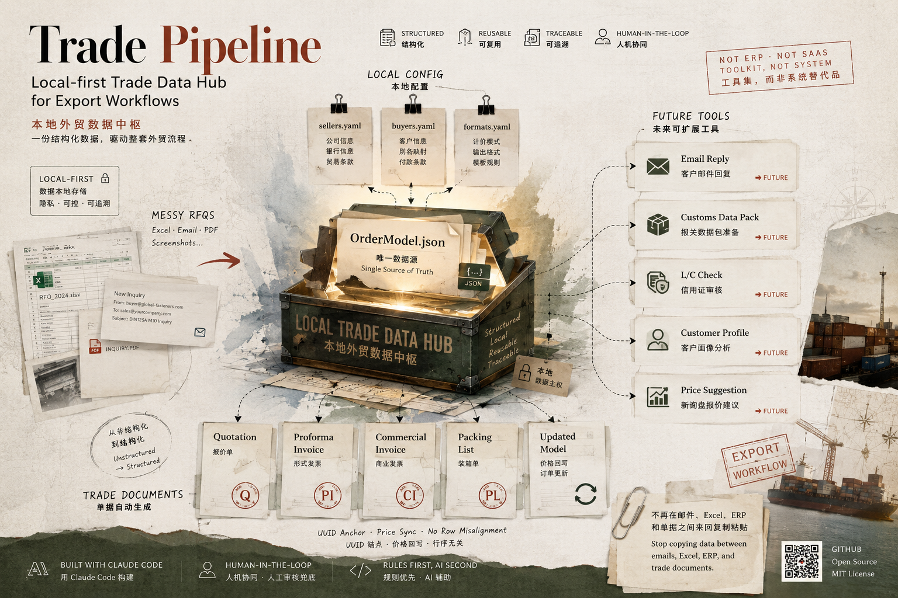
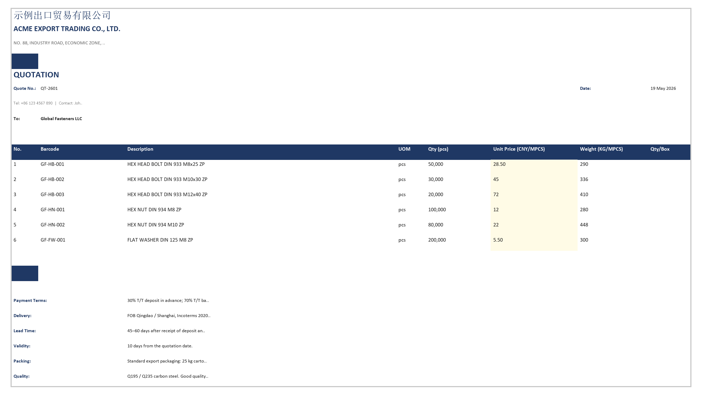
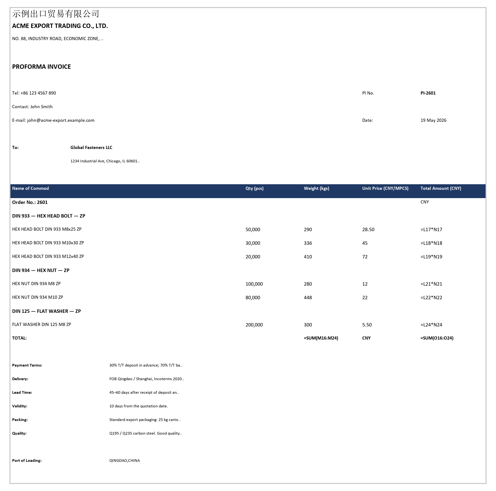
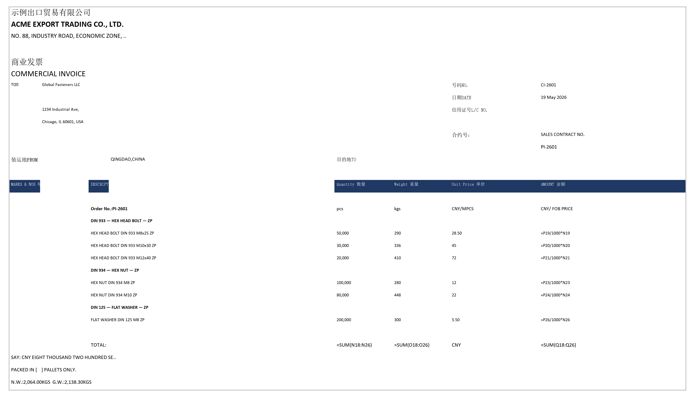
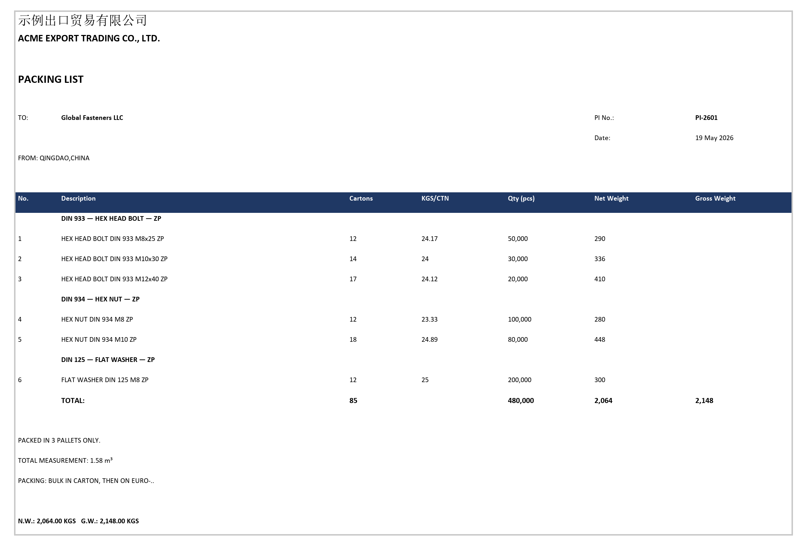
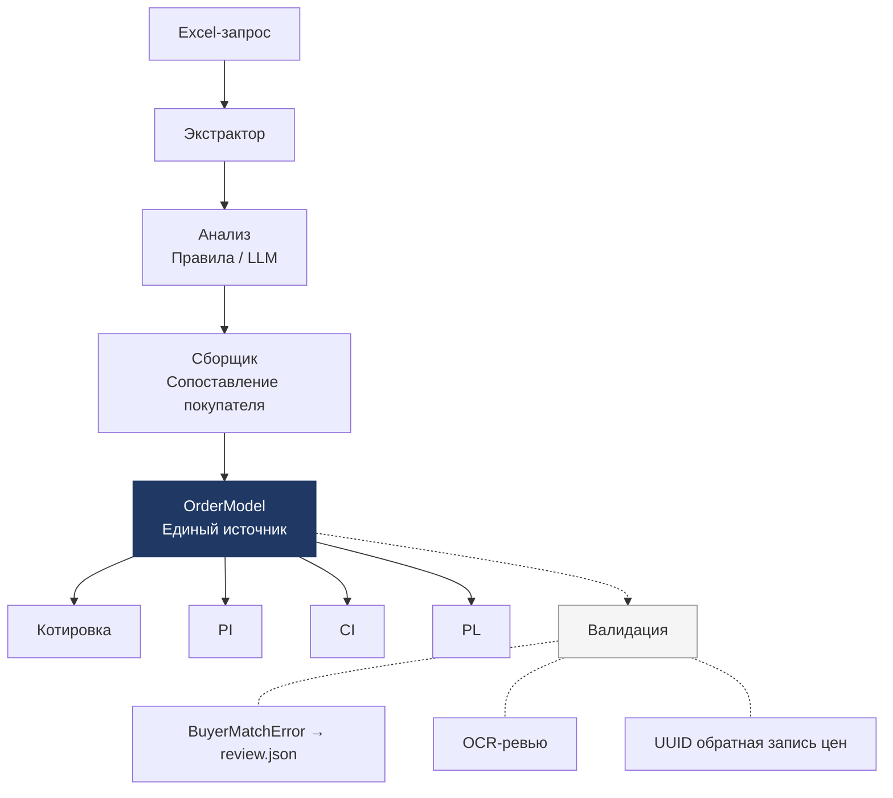

# Trade Pipeline — Локальный торговый хаб данных и автоматизация документов

> Это техническая версия. Обзор для бизнес-пользователей доступен в [китайском README](README.md).

[中文](README.md) | [English](README_EN.md)

<p align="center">
  <a href="LICENSE"></a>
  <a href="https://python.org"></a>
  <a href="https://claude.ai/code"></a>
  
</p>

Проект AI-автоматизации, выросший из реальных задач производственной внешнеторговой компании. С помощью Claude Code запросы клиентов, котировки, PI, CI и PL собраны в единый повторно используемый конвейер данных. Цель проекта — не демонстрация навыков программирования, а показ того, как AI-агент обрабатывает данные, генерирует документы, контролирует ошибки и передаёт решение человеку в ключевых точках.

<p align="center">
  Заполните цены — PI / CI / PL генерируются автоматически. Измените одну цифру — все документы обновятся.
</p>

> **От запроса клиента до полного комплекта торговых документов — одной командой. Структурированные торговые данные с первого заказа.**
>
> RFQ · Котировка · Проформа-инвойс · Коммерческий инвойс · Упаковочный лист · Обратная запись цен

<p align="center">
  
</p>

---

## Зачем это нужно

Проблема торговых документов — не «сделать один Excel», а то, что одни и те же данные о клиенте, товарах, ценах и условиях приходится вручную вносить в 4 разных файла:

| Данные | Котировка | PI | CI | PL |
|--------|-----------|----|----|-----|
| Клиент/адрес | ✓ | ✓ | ✓ | ✓ |
| Товары | ✓ | ✓ | ✓ | ✓ |
| Цена/сумма | ✓ | ✓ | ✓ | — |
| Упаковка/вес | — | — | — | ✓ |

Изменить название товара? Менять четыре раза. Пропустить одно? Клиент заметит раньше вас.

Подход trade-pipeline: **Парсить один раз, сохранить в OrderModel, генерировать все документы из одного источника.**

---

## Быстрый старт

Четыре шага — без настройки, репозиторий содержит демо-данные:

```bash
# 1. Клонировать и установить
git clone https://github.com/Dangooy/trade-pipeline.git
cd trade-pipeline
pip install -e .

# 2. Инициализация: данные компании, условия торговли, валюта, покупатели (можно пропустить для демо)
python -m trade_pipeline init

# 3. Запустить демо
python -m trade_pipeline --input examples/sample_inquiry.xlsx --order DEMO --buyer global_fasteners

# 4. Результат в output/DEMO/ — 6 файлов ↓
```

| Файл | Описание |
|------|----------|
| `DEMO_rfq.json` | Структурированные данные из запроса |
| `DEMO_model.json` | OrderModel — единый источник данных |
| `DEMO_quotation.xlsx` | Котировка (колонка цен для заполнения) |
| `DEMO_pi.xlsx` | Проформа-инвойс |
| `DEMO_ci.xlsx` | Коммерческий инвойс |
| `DEMO_pl.xlsx` | Упаковочный лист |

### Примеры

**Котировка** — жёлтая колонка для цен, скрытая UUID-колонка для привязки:



**Проформа-инвойс (PI)** — заголовки продавца/покупателя, группировка, условия оплаты:



**Коммерческий инвойс (CI)** — двуязычные заголовки, маркировка, SAY:



**Упаковочный лист (PL)** — группировка, коробки/вес/кол-во, итоги по паллетам:



---

## Ключевые технические решения

### 1. Почему UUID, а не номер строки?

После отправки котировки клиент может вставить строки, изменить порядок, добавить заголовки групп. Привязка цен по номерам строк ломается.

Решение: скрытая UUID-колонка. Обратная запись цен находит строки по UUID независимо от редактирования.

### 2. Почему жёсткая блокировка при ошибке сопоставления?

4-уровневый нечёткий поиск (юр. название → псевдоним → подстрока → догадка). Если все уровни не совпали — система действительно не знает. Генерируется `review.json`, конвейер останавливается, ждёт подтверждения человека.

### 3. Почему все Writer читают только OrderModel?

Четыре документа — один источник данных. Ни один Writer не перечитывает Excel. Изменение в одном месте обновляет все четыре документа.

### 4. Сначала правила или LLM?

- **Режим правил** (по умолчанию): быстро, детерминированно, бесплатно
- **Режим LLM** (`--use-llm`): вызов Claude API для нестандартных форматов
- Двухуровневый кэш: автоматически сбрасывается при смене версии промпта

### 5. Три модели ценообразования

| Формат | Сценарий | Автоопределение |
|--------|----------|-----------------|
| CNY/MPCS | Внутренние клиенты, крепёж | ✅ из заголовков столбцов |
| USD/PC | Международные клиенты | ✅ |
| USD/TON | Шайбы по весу | ✅ |

---

## Что это такое

trade-pipeline — не замена ERP и не SaaS.

Это **локальный структурированный торговый хаб данных** с набором инструментов автоматизации.

> **Один структурированный набор данных для всех инструментов.**

### Локальный хаб данных

| Файл данных | Назначение |
|-------------|-----------|
| `config/config.yaml` — sellers | Информация о продавце, банковские реквизиты |
| `config/config.yaml` — buyers | Юридические названия покупателей, псевдонимы, ИНН |
| `config/config.yaml` — formats | Модели ценообразования, правила вывода |
| `output/<заказ>/<заказ>_model.json` | Полный снимок заказа (OrderModel) |

---

## Отношение к ERP

trade-pipeline — **лёгкий рабочий слой вокруг ERP**, не замена.

- **До ERP**: структурирование запросов из Excel / PDF / email
- **После ERP**: генерация клиентских Котировка / PI / CI / PL
- **Параллельно ERP**: накопление данных о клиентах, заказах, ценах

### Традиционный подход vs trade-pipeline

| Этап | Традиционно | trade-pipeline |
|------|------------|----------------|
| Обработка запроса | Ручной ввод в ERP или Excel | Автоизвлечение из Excel в RFQ |
| Идентификация клиента | Точное совпадение — опечатка = не найден | 4-уровневый нечёткий поиск (вкл. ООО/ОАО) |
| Котировка→PI→CI→PL | Каждый документ отдельно | OrderModel — один источник, одна команда |
| Обратная запись цен | По номеру строки — ломается | UUID-привязка, не зависит от порядка |
| Изменение шаблонов | Вызывать консультанта ERP | config.yaml за 5 минут |

### Для кого

- Заказов в год: **50–500**
- SKU: **< 5 000**
- Основные рынки: **Россия / Восточная Европа / Южная Америка / Ближний Восток**
- Команда: **1–3 менеджера ВЭД + 1 человек для config.yaml**

| Ситуация | Подходит? |
|----------|----------|
| Нет ERP, Excel + мессенджеры | Да — основной сценарий |
| ERP со слабым модулем документов | Да — фронтенд и вывод документов |
| Odoo / ERPNext | Можно интегрировать |
| SAP / NetSuite / D365 | Низкая необходимость |
| EDI/API интеграция | Не подходит |

---

## Отраслевая применимость

Текущая версия оптимизирована для **крепежной отрасли** — перевод названий и логика группировки специфичны для крепежа.

Ядро конвейера **не ограничено крепежом**. Условия адаптации:

- Запросы через Excel
- Цены за штуку (PCS), тысячу (MPCS), кг (KG) или тонну (TON)
- Нужны Котировка / PI / CI / PL

**Подходит**: крепёж, шайбы, метизы, стандартные детали, проволока, трубная арматура, фланцы, подшипники.

**Менее подходит**: одежда, электроника, сырьё, кросс-бордер e-commerce (SKU > 10K).

---

## Что это НЕ является

- **❌ Не ERP** — не управляет складом, финансами, налогами, правами доступа
- **❌ Не SaaS** — нет облачного аккаунта, нет SLA
- **❌ Не облачная платформа** — данные хранятся локально
- **❌ Не платформа для совместной работы** — для команд 1–3 человека
- **❌ Не «ИИ ведёт торговлю за вас»** — ИИ парсит нестандартные запросы; правила и человек контролируют
- **❌ Не подключён к таможне** — может подготовить данные, но не подаёт

---

## Установка

1. Клонировать репозиторий
2. `pip install -e .`
3. Открыть проект в Claude Code — `.claude/skills/` загружается автоматически

```bash
git clone https://github.com/Dangooy/trade-pipeline.git
cd trade-pipeline
pip install -e .
```

Навыки соответствуют открытому формату [Agent Skills](https://agentskills.io) и могут быть адаптированы другими агентами.

### Командная строка

```bash
# Только котировка (для переговоров по цене):
python -m trade_pipeline --input inquiry.xlsx --order 2601 --buyer global_fasteners --quote-only

# После подтверждения цен — обратная запись + генерация PI / CI / PL:
python -m trade_pipeline --price-update output/2601/2601_quotation.xlsx --model output/2601/2601_model.json

# Все документы сразу (демо):
python -m trade_pipeline --input examples/sample_inquiry.xlsx --order DEMO --buyer global_fasteners
```

---

## Архитектура



### 8 шагов конвейера

| Шаг | Модуль | Что делает |
|-----|--------|-----------|
| 1 | `extractors/excel_extractor.py` | Автоопределение формата, выбор листа, извлечение данных |
| 2 | `understanding/llm_parser.py` | Парсинг в RFQ (правила или Claude API, с кэшем L1/L2) |
| 3 | `understanding/canonicalizer.py` | Нормализация: DIN/ISO/GB стандарты, CN→EN перевод |
| 4 | `understanding/assembler.py` | Сопоставление покупателя, сборка OrderModel |
| 5 | `writers/quote_writer.py` | Котировка + скрытая UUID-колонка |
| 6 | `writers/pi_writer.py` | Проформа-инвойс |
| 7 | `writers/ci_writer.py` | Коммерческий инвойс + SAY |
| 8 | `writers/pl_writer.py` | Упаковочный лист (Lite встроенный + внешний движок) |

## Проектные документы

- [Gate Pattern](docs/gate-pattern.md) — Трёхуровневая модель контроля AI-навыков
- [Output Verification](docs/output-verification.md) — Три стратегии верификации AI-документов
- [LLM Wiki Pattern](docs/llm-wiki-pattern.md) — Построение базы знаний с AI (паттерн Карпати)

## Как я создал это с Claude Code

Я не программист — я занимаюсь внешней торговлей на производственном предприятии. Этот проект появился потому, что создание торговых документов отнимало часы каждую неделю, а Claude Code помог решить эту проблему.

**Реальная история ошибки → совместного решения:**

После заполнения котировки цены нужно записать обратно в систему. Первая версия Claude использовала **привязку по номеру строки** — «строки с 6 по 15 — это данные, читаем колонку цен последовательно». Код чистый, локальные тесты прошли.

Потом я запустил на реальном заказе. Клиент вставил 3 строки заголовков групп и удалил один товар. Все цены сместились — цена болта M8 попала на M10, M12 — на шайбы. **Система не выдала ошибку. Она молча сгенерировала PI с полностью неправильными суммами.**

Я сказал Claude: «Можно использовать какой-то ID вместо номеров строк?» Claude спроектировал скрытую UUID-колонку — каждый товар имеет уникальный идентификатор. Обратная запись находит строки по UUID, независимо от редактирования.

Выводы:

- **AI отлично пишет код, но обнаружение реальных граничных условий требует опыта в бизнесе.** Я точно знал, как должен выглядеть PI, потому что сделал сотни вручную.
- **Самое ценное — не «сделать правильно с первого раза», а итерация на реальных данных.**
- **Хорошие решения рождаются из ошибок на реальных заказах, а не из обсуждений архитектуры.**

> MCP использовался только при разработке. Код не зависит от MCP — клонируйте и запускайте.

## Стек технологий

- **Python 3.12** + openpyxl + PyYAML
- **Claude API** (опционально, для LLM-парсинга)
- **Claude Code** + MCP (среда разработки)

## Лицензия

MIT
